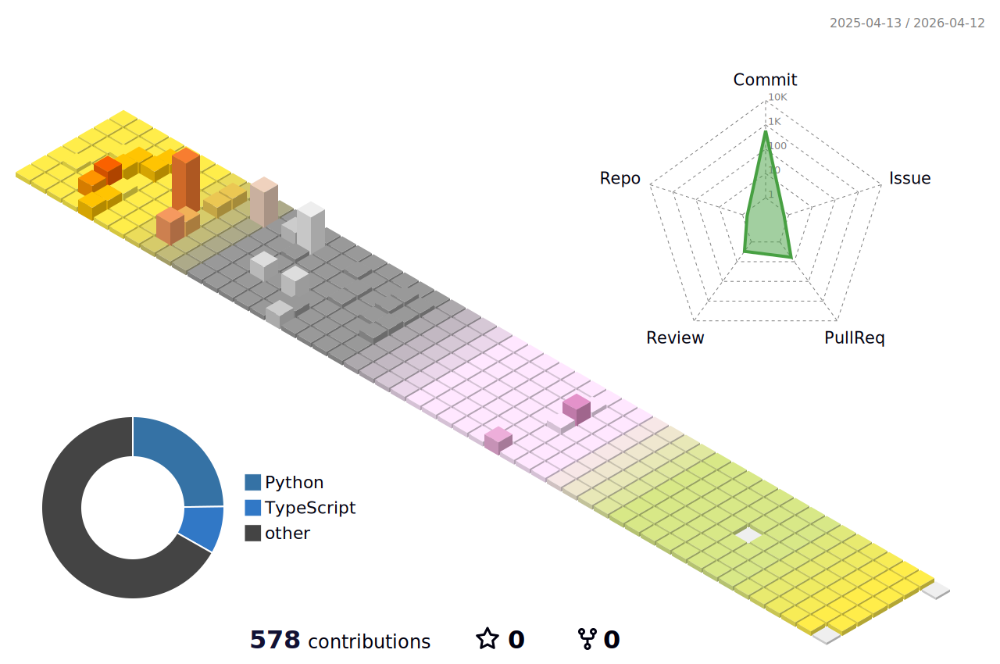

## :sparkles: GITHUB Analytic :sparkles:

 

## :sparkles: Tech Stacks :sparkles:

  

    
    
    
    
    
  

  

    
    
  

  

    
    
    
    
    
    
  

  

    
    
    
  

 

## :sparkles: Cowork Tools :sparkles:

     

 

## :sparkles: Diary :sparkles:

 

## :sparkles: BOJ / Solved.ac :sparkles:

