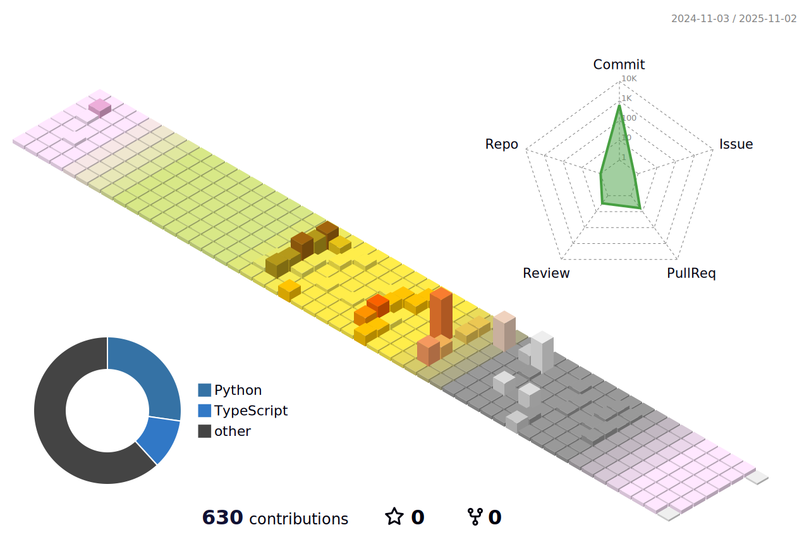

## ✨ 소개 ✨

👨‍💻 꾸준한 학습을 통해 점진적으로 성장하는 것을 목표로 노력하고 있습니다.  
🛠️ 개발은 사용자의 편리함을 높여주는 효과적인 도구라고 생각합니다.

 

## ✨ 기술스택 ✨

<table>
	<thead>
		<tr border: none;>
		<td><b>LANGUAGE</b></td>
		<td><b>FRAMEWORK</b></td>
		</tr>
	</thead>
	 <tbody>
		 <tr>
			<td width="500">
				
				
				
			</td>
			<td width="500">
			  
			  
			</td>
		 </tr>
	 </tbody>
</table>

<table>
	<thead>
		<tr border: none;>
			<td><b>TOOL</b></td>
			<td><b>ETC</b></td>
		</tr>
	</thead>
 <tbody>
	 <tr>
		<td width="500">
		  	
			
			
			
			
		</td>
		<td width="500">
			
			
			
	 </tr>
 </tbody>
</table>

 

## ✨ 개발 현황 ✨

